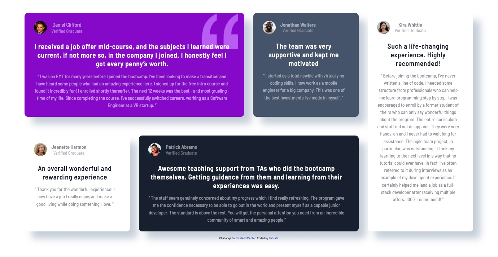

# Frontend Mentor - Testimonials grid section solution

This is a solution to the [Testimonials grid section challenge on Frontend Mentor](https://www.frontendmentor.io/challenges/testimonials-grid-section-Nnw6J7Un7). Frontend Mentor challenges help you improve your coding skills by building realistic projects.

## Table of contents

- [Overview](#overview)
  - [The challenge](#the-challenge)
  - [Screenshot](#screenshot)
  - [Links](#links)
- [My process](#my-process)
  - [Built with](#built-with)
  - [What I learned](#what-i-learned)
  - [Useful resources](#useful-resources)
- [Author](#author)

## Overview

The challenge was to create a testimonial section in one column layout for mobile devices and grid area for desktop screens.

### The challenge

Users should be able to:

- View the optimal layout for the site depending on their device's screen size

### Screenshot

##### Mobile view:


##### Tablet / Notebooks devices:


##### Desktop view:



### Links

- Solution URL: https://github.com/DvoraG/testimonials-grid-section
- Live Site URL: https://dvorag.github.io/testimonials-grid-section/

## My process

### Study of the design:

The mobile design is a one column layout and will become a grid area on desktop displays.
Each testimonial is organized as a header with an image, name and title,
a heading and a citation.

### Built with

- Semantic HTML5 markup
- CSS custom properties
- Flexbox
- CSS Grid
- Mobile-first workflow

### What I learned

Beside getting more used applying grid, I foound good use for pseudo elements and pseudo classes in this challenge. To manage the different color and background color combinations I used :nth-child(). The quotation svg got added using the ::before pseudo element.

```css
.testimonial:first-child::before {
  content: url("../images/bg-pattern-quotation.svg");
  transform: scale(1.2);
  position: absolute;
  top: 0.75rem;
  right: 2rem;
  z-index: -10;
}
```

Found here:
https://stackoverflow.com/questions/36259410/how-to-set-size-of-svg-image-in-before-pseudo-class

### Useful resources

"stack overflow":
https://www.stackoverflow.com -
Usually this is one of the first places I am looking for solutions. During this challenge I had to change the size of the svg. There I found the solution using **transform: scale(#);** and used it in the above CSS code snippet.

## Author

- Frontend Mentor - [@DvoraG](https://www.frontendmentor.io/profile/DvoraG)
